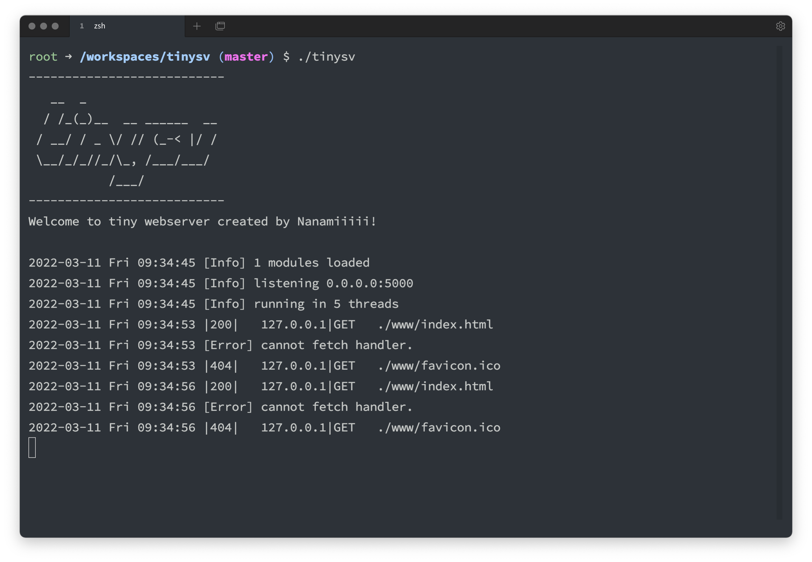

# tinysv
A minimal extensive server



## Dependencies
- gcc
- CMake (>= 3.21)
- libexpat

## Build 
### All binary & modules
```
git clone https://github.com/Nanamiiiii/tinysv.git
cd tinysv
mkdir build && cd build
cmake ..
make
```
outputs are stored in `build/tinysv`

### build only modules
tinysv can expand functionality. For detail, look modules section.  
You must modify `CMakeLists.txt` for modules.

```
cd modules
mkdir build && cd build
cmake ..
make
```

## Usage
```bash
./tinysv --server 0.0.0.0 --port 8080 # specify address & port
./tinysv --thread 3 # specify number of thread
./tinysv --help # For more information
```

## Configuration
Some configuration is defined in `config.xml` in root directory. This configuration is written in typical xml format.  
Sample configuration is below.
```xml
<?xml version="1.0"?>
<Config>
    <!-- server configuration -->
    <Server>
        <Address>0.0.0.0</Address>
        <Port>5000</Port>
        <Root>./www</Root> <!-- root directory for server -->
        <RootFile>index.html</RootFile> <!-- default filename to retrive -->
    </Server>

    <!-- module configuration -->
    <Modules>
        <Module>
            <Name>default</Name>
            <Object>default_module.so</Object>
        </Module>
    </Modules>

    <!-- handler configuration -->
    <FileHandle>
        <Handler>
            <Name>default</Name>
            <Ext>.html</Ext>
        </Handler>
    </FileHandle>
    <RouteHandle>
    </RouteHandle>
</Config>
```

## Modules
This application use shared libraries as modules.  
Sample source of module below.
```c
/* default_module.c */

/* This is the sample module of tinysv */

#include "module.h" // must include
#include "logger.h"

/* Entry point: __handler */
/* @ctx: request context  */
void __handler(CTX* ctx) {
    // do something
}
```
- modules are loaded at startup.
- modules must have function named `__handler`
    - tinysv serach this symbol when load module.
- the argument `ctx` is struct defined in `module.h`
    - this struct has request information and additional data.
    - modules should set response information to this.
- To use external libraries, you must modify `Makefile`.

## Known issues
- Segmentation fault when running for long time.
- This server close connection after sending response, but it shuld be kept.
